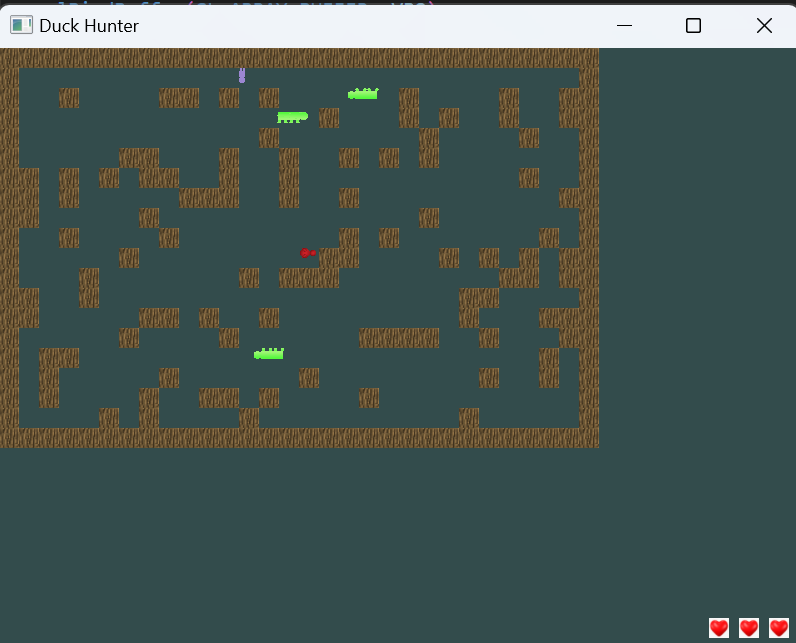

# Duck Hunter - Project Overview

For this project, I will develop an interactive 2D game titled **"Duck Hunter"** using OpenGL and C++. The objective of the game is for the player to navigate through a forest from the south end to the north end, encountering and attacking ducks and foxes along the way. 

As aforementioned, the game will feature both beneficial and dangerous elements, including foxes that serve as hazards—colliding with one will cause the player to lose. Picking up ducks that were killed will restore health. The game ends successfully once the player reaches the north end of the forest. The map layout and placement of objects is pre-set.

---

## Core Features and Implementation Plan

This project will fulfill the required components in the following ways:

### 2D Objects (35 pts)
- The player character, ducks, and foxes will be implemented as separate C++ classes.
- Each object will be composite, consisting of multiple shapes (e.g., ducks made of circles and triangles, foxes made of polygons).
- Ducks will have a back-and-forth movement pattern (West to East and back).
- Foxes will move in the same movement pattern as the ducks.

### Textures (35 pts)
- Ducks, foxes, and the player will be textured to enhance realism.
- The forest background will be textured instead of a plain color.
- Texture files will be stored in a separate directory.

### User Input & Interaction (30 pts)
- The player will control movement using the keyboard (e.g., arrow keys or WASD).
- Attacking will be handled via the space button (e.g., clicking to attack ducks and foxes).
- The game will provide user instructions in a `README.md` file.

### View & Transformations (30 pts)
- The camera will pan to follow the player as they move north.
- The player’s attack animation will involve rotations and scaling transformations.

### Dynamic Transitions (Extra Credit Consideration)
- Ducks will fade out when hit instead of disappearing instantly.
- A smooth transition animation will play when the player reaches the end of the forest.
- If the player collides with a fox, a short game-over sequence will display before restarting.

## Interaction Instructions
### Zooming in/out
With your mouse wheel, scroll up to zoom in and down to zoom out.

### Move the player around
To move your player from the top of the screen, where it spawned, use the WASD keys:
- W moves north
- A moves West
- S moves south
- D moves East